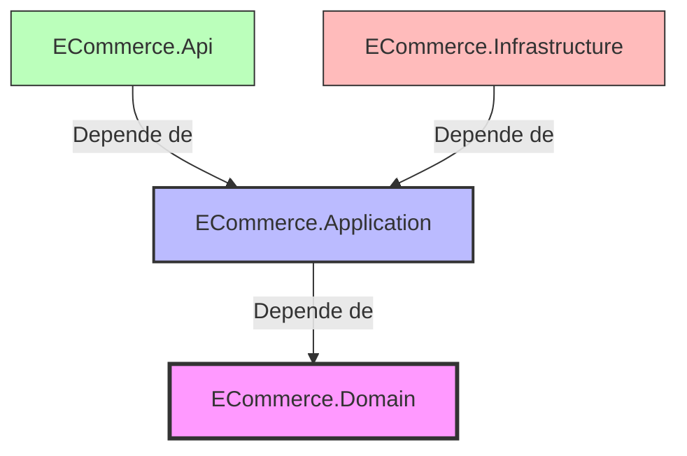
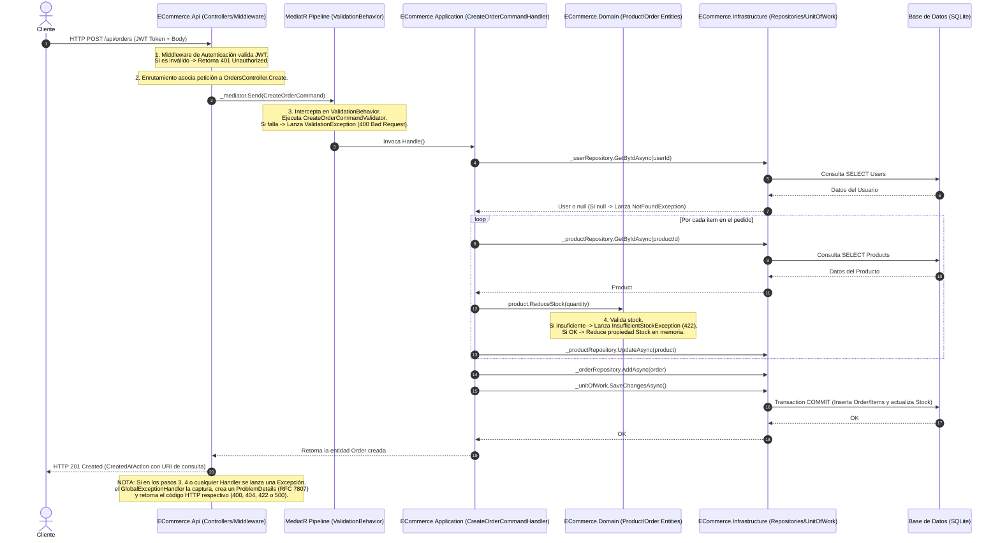

---

## 🏗️ 1. Arquitectura del Sistema: Clean Architecture

El proyecto implementa **Clean Architecture** (Arquitectura Limpia), cuyo objetivo principal es la **independencia de frameworks, bases de datos y agentes externos**, logrando un sistema altamente testeable, mantenible y desacoplado.

El núcleo de esta arquitectura es la **Regla de Dependencia**: *las dependencias de código solo pueden apuntar hacia adentro*. Las capas internas no conocen nada de las capas externas.

### Detalle de las Capas

1. **`ECommerce.Domain` (Núcleo - Capa Central)**:
   * **Responsabilidad**: Contiene las entidades de negocio (`Product`, `Order`, `OrderItem`, `User`), enums (`UserRole`) y excepciones de negocio específicas del dominio (`DomainException`, `DomainRuleException`, `InsufficientStockException`).
   * **Características**:
     * Es **100% pura**: no depende de ninguna base de datos (EF Core), framework web (ASP.NET Core) o librería externa.
     * Implementa **DDD Lite (Domain-Driven Design Lite)**: las entidades no son simples contenedores de datos anémicos (propiedades `get; set;` sin lógica), sino que encapsulan el comportamiento y las reglas de negocio críticas.
     * *Ejemplo*: La entidad `Product` contiene los métodos `ReduceStock(quantity)` y `UpdatePrice(newPrice)`. Ella misma valida sus reglas antes de cambiar su estado interno (ej. lanzar `InsufficientStockException` si el stock solicitado es mayor al disponible).

2. **`ECommerce.Application` (Casos de Uso)**:
   * **Responsabilidad**: Define qué puede hacer la aplicación (los casos de uso) mediante comandos y consultas (**CQRS**).
   * **Tecnologías**: Usa **MediatR** como mediador en memoria y **FluentValidation** para verificar la validez sintáctica de las entradas.
   * **Características**:
     * Define las interfaces (contratos) de persistencia como `IProductRepository`, `IOrderRepository` e `IUnitOfWork`.
     * No sabe cómo se guardan los datos, solo sabe que existe una abstracción que lo hace.

3. **`ECommerce.Infrastructure` (Detalles Tecnológicos / Persistencia)**:
   * **Responsabilidad**: Implementa las abstracciones de la capa de aplicación. Contiene el acceso físico a datos, la base de datos (**EF Core con SQLite**) y la implementación de los repositorios y la unidad de trabajo (`UnitOfWork`).
   * **Características**:
     * Utiliza **Fluent API** (`IEntityTypeConfiguration<T>`) para configurar el mapeo objeto-relacional (ORM), manteniendo las entidades de dominio limpias de atributos relacionales (`[Key]`, `[ForeignKey]`).

4. **`ECommerce.Api` (Capa de Presentación / Punto de Entrada)**:
   * **Responsabilidad**: Expone los endpoints HTTP (REST), maneja la autenticación/autorización basada en roles usando **JWT (JSON Web Tokens)**, define la configuración de dependencias (Composition Root en `Program.cs`) y centraliza el manejo de excepciones a través de un middleware global (`GlobalExceptionHandler`).

---

## 🔄 2. El Flujo de una Solicitud HTTP (Paso a Paso)

Para el examen, es crucial saber explicar el ciclo de vida de una petición HTTP. Tomemos como ejemplo:  
`POST /api/orders` con un cuerpo JSON para comprar productos y un header `Authorization: Bearer <token>`.

---

## 🛠️ 3. Patrones de Diseño Aplicados y Justificación

### A. CQRS (Command Query Responsibility Segregation)
* **¿Qué es?** Separación de la lectura (Queries) y la escritura (Commands) de datos en modelos diferentes.
* **Justificación**: En este sistema se aplica a nivel lógico. Los comandos representan intenciones de cambio de estado (ej. `CreateOrderCommand`) y devuelven la entidad creada o modificada. Las consultas representan solicitudes de lectura sin efectos secundarios (ej. `GetOrderByIdQuery`). Esto mejora la escalabilidad, la separación de responsabilidades y simplifica las optimizaciones de rendimiento futuras (por ejemplo, usar Dapper/SQL plano para lecturas rápidas y EF Core para escrituras complejas).

### B. Mediator (Mediador)
* **¿Qué es?** Un patrón que reduce el acoplamiento directo entre componentes al hacer que se comuniquen a través de un objeto mediador.
* **Justificación**: Implementado con **MediatR**. Los controladores de la API (`OrdersController`, `ProductsController`) no inyectan directamente repositorios o servicios de aplicación. Solo inyectan `IMediator`. Cuando reciben un request HTTP, lo empaquetan en un Command o Query y lo envían a `_mediator.Send()`. MediatR se encarga de buscar su respectivo `IRequestHandler` y ejecutarlo. Esto mantiene los controladores sumamente limpios y facilita la adición de interceptores globales (Behaviors).

### C. Pipeline Behavior (Middleware de MediatR)
* **¿Qué es?** Un patrón que actúa como un filtro/middleware alrededor de la ejecución de una petición de MediatR.
* **Justificación**: `ValidationBehavior` intercepta automáticamente cualquier request antes de llegar al handler. Si hay errores sintácticos (validados por FluentValidation), interrumpe el flujo lanzando una excepción. Esto evita repetir código de validación en cada Handler o Controller, manteniendo el principio DRY (Don't Repeat Yourself).

### D. Repository y Unit of Work (Repositorio y Unidad de Trabajo)
* **Repository**: Abstrae el acceso a datos. La capa de negocio interactúa con interfaces (`IProductRepository`), desacoplándose de la base de datos real (SQLite) y del ORM (EF Core).
* **Unit of Work**: Mantiene una lista de objetos afectados por una transacción de negocio y coordina la escritura de cambios como una única transacción atómica.
* **Justificación**: En `CreateOrderCommandHandler`, descontamos stock de múltiples productos e insertamos la orden. Si uno de los productos no tiene stock o falla la inserción de la orden, la transacción completa debe revertirse (Atomicidad - ACID). El `IUnitOfWork` garantiza que todas las llamadas previas con `saveChanges: false` en los repositorios se guarden juntas en una sola transacción al invocar `SaveChangesAsync()`.

---

## ❓ 4. Banco de Preguntas y Respuestas (Nivel Examen Universitario)

### Pregunta 1: ¿Por qué en Clean Architecture la capa de Domain no contiene referencias a Entity Framework Core o ASP.NET Core?
**Respuesta**:  
Por el **Principio de Inversión de Dependencias** y la **Regla de Dependencia** de Clean Architecture. El dominio contiene las reglas esenciales del negocio y debe ser inmune a los cambios de tecnología externa. Si dependiera de EF Core y el día de mañana se decide cambiar a un ORM diferente (como Dapper o MongoDB), habría que modificar las entidades del negocio, violando el principio de diseño de que las políticas de alto nivel no deben depender de los detalles de bajo nivel. El dominio debe ser código de C# puro.

### Pregunta 2: Explique la diferencia entre un "Dominio Anémico" y un "Dominio Rico" (DDD Lite). ¿Cómo se ve esto en el proyecto?
**Respuesta**:  
* **Dominio Anémico**: Las entidades son meras bolsas de propiedades públicas con getters y setters públicos sin comportamiento (`DTOs` glorificados). Toda la lógica de negocio se encuentra en clases de servicios externas. Esto dispersa las reglas de negocio y dificulta garantizar la consistencia del estado del objeto.
* **Dominio Rico**: Las entidades encapsulan tanto el estado (propiedades) como el comportamiento (métodos de negocio).
* **En el proyecto**: Se implementa un Dominio Rico. Por ejemplo, en la clase [Product.cs](file:///c:/Users/leone/ECommerce%20Backend/src/ECommerce.Domain/Entities/Product.cs#L14-L37), el método `ReduceStock(quantity)` encapsula la regla de negocio que impide reducir stock si el valor es negativo o si no hay stock suficiente, lanzando excepciones controladas desde dentro de la propia entidad en lugar de delegarlo a un servicio externo.

### Pregunta 3: ¿Qué papel juega la biblioteca MediatR en la implementación de CQRS y cómo ayuda a cumplir el Principio de Responsabilidad Única (SRP)?
**Respuesta**:  
MediatR actúa como un despachador en memoria. Separa la recepción del estímulo (el endpoint en el controlador) de la ejecución del proceso de negocio (el handler).
Ayuda a cumplir el **Principio de Responsabilidad Única (SRP)** porque en lugar de tener un controlador gigante con múltiples métodos que acceden a repositorios, cada caso de uso se define en un archivo separado: un Command/Query (que define los datos de entrada) y un Handler (que procesa la acción). Cada clase tiene una sola razón para cambiar: el comportamiento de ese caso de uso en particular.

### Pregunta 4: Describa el funcionamiento de `ValidationBehavior` en el pipeline de MediatR. ¿Qué beneficio aporta frente a validar en el controlador?
**Respuesta**:  
`ValidationBehavior<TRequest, TResponse>` implementa `IPipelineBehavior`. Funciona como un middleware intermedio en la tubería de MediatR. Cuando se envía un Command, el comportamiento intercepta la petición, busca todos los validadores registrados de FluentValidation que correspondan a ese comando, y ejecuta la validación. Si existen errores, interrumpe el pipeline lanzando una `ValidationException` antes de que se ejecute el handler de negocio.
**Beneficio**: Centraliza la validación sintáctica (formatos de datos, rangos numéricos, campos obligatorios). Desacopla por completo a los controladores de la lógica de validación de entradas y garantiza que ningún Handler reciba un comando con datos sintácticamente inválidos.

### Pregunta 5: ¿Cómo se manejan los errores de manera global en esta aplicación y qué estándar de la industria sigue la respuesta?
**Respuesta**:  
Se utiliza la interfaz `IExceptionHandler` de .NET 8, registrada mediante `builder.Services.AddExceptionHandler<GlobalExceptionHandler>().AddProblemDetails()` en `Program.cs`. 
Este middleware captura cualquier excepción no controlada que ocurra en el pipeline HTTP de la aplicación. Mediante una instrucción `switch`, mapea tipos de excepciones específicas a códigos de estado HTTP correctos:
* `NotFoundException` $\rightarrow$ `404 Not Found`
* `ValidationException` $\rightarrow$ `400 Bad Request`
* `AuthenticationException` $\rightarrow$ `401 Unauthorized`
* `DomainException` $\rightarrow$ `422 Unprocessable Entity` (utilizado para violaciones de reglas de negocio como stock insuficiente)
* Excepciones generales $\rightarrow$ `500 Internal Server Error`

La respuesta se formatea siguiendo el estándar de la industria **RFC 7807 (Problem Details for HTTP APIs)** utilizando el tipo de contenido `application/problem+json`, lo que proporciona un esquema estándar para reportar errores en APIs web.

### Pregunta 6: ¿Por qué la creación de una orden devuelve un código HTTP `201 Created` en lugar de un `200 OK` y qué información adicional aporta en la cabecera?
**Respuesta**:  
Siguiendo las buenas prácticas del protocolo HTTP y de las APIs RESTful:
* El código **`201 Created`** indica explícitamente que la petición HTTP POST tuvo éxito y que se ha creado un nuevo recurso en el servidor.
* La respuesta incluye una cabecera HTTP **`Location`** que contiene la URI absoluta o relativa del recurso recién creado (por ejemplo, `/api/orders/5`), permitiendo al cliente saber exactamente dónde puede consultar el estado del recurso creado. En el código del controlador se logra usando `CreatedAtAction(nameof(GetById), new { id = order.Id }, order)`.

### Pregunta 7: Si la base de datos se cambia de SQLite a SQL Server, ¿qué capas del proyecto tendrían que modificarse? Justifique en base a Clean Architecture.
**Respuesta**:  
Únicamente se modificaría la capa **`ECommerce.Infrastructure`** (y el archivo de configuración `appsettings.json` en `ECommerce.Api`).
* **Justificación**: Como la capa `Domain` y la capa `Application` no tienen ninguna referencia física ni dependencia de EF Core o SQLite (solo dependen de interfaces abstractas como `IProductRepository`), los casos de uso siguen siendo exactamente los mismos. En la capa de infraestructura solo se cambiaría la configuración del proveedor en el `DbContext` (reemplazando `UseSqlite` por `UseSqlServer`) y posiblemente las migraciones de EF Core. Esto demuestra el alto nivel de mantenibilidad y bajo acoplamiento que ofrece Clean Architecture.

### Pregunta 8: ¿Cómo se configura y valida la seguridad basada en JWT en este proyecto? Diferencie Autenticación de Autorización.
**Respuesta**:  
* **Autenticación (Quién eres)**: Se implementa en `AuthController.Login`. El usuario envía sus credenciales. Si son correctas, el servidor genera un token JWT firmado digitalmente con una clave simétrica secreta (`SymmetricSecurityKey`). Este token contiene información (claims) como el nombre de usuario, el ID y su rol.
* **Autorización (Qué puedes hacer)**: .NET Core utiliza el middleware `UseAuthorization()`. En los endpoints, se aplican atributos restrictivos. Por ejemplo, en [ProductsController.cs](file:///c:/Users/leone/ECommerce%20Backend/src/ECommerce.Api/Controllers/ProductsController.cs#L41-L42), el método `Create` tiene el atributo `[Authorize(Roles = UserRoles.Admin)]`. Aunque un usuario esté autenticado con un token válido (Autenticación), si su claim de Rol no es `Admin`, el middleware de autorización le denegará el acceso retornando un código **`403 Forbidden`**.

### Pregunta 9: ¿Qué ocurre con la base de datos cuando se inicia la aplicación por primera vez? ¿Cómo está resuelto técnicamente en el código?
**Respuesta**:  
El sistema realiza dos acciones automáticas en la inicialización dentro de [Program.cs](file:///c:/Users/leone/ECommerce%20Backend/src/ECommerce.Api/Program.cs#L110-L126):
1. **Migraciones automáticas**: Obtiene el contexto de base de datos (`ApplicationDbContext`) de los servicios y ejecuta `context.Database.Migrate()`. Esto crea el archivo SQLite físico y aplica todas las migraciones de tablas pendientes sin necesidad de intervención manual.
2. **Sembrado de Datos (Seeding)**: Verifica si existe algún usuario con el rol de `Admin`. Si la tabla de usuarios está vacía, inserta automáticamente un usuario administrador por defecto (`admin` / `Admin123!`) aplicando un algoritmo de hash seguro para su contraseña (`PasswordHasher.Hash`) para que el sistema esté listo para probar.

### Pregunta 10: ¿Qué patrón se implementa para mapear los objetos del dominio con las tablas relacionales y dónde se configura en el proyecto?
**Respuesta**:  
Se utiliza el patrón **Data Mapper** a través de **Entity Framework Core** (un ORM). La configuración de mapeo relacional se realiza de manera declarativa y desacoplada mediante clases de configuración independientes en la capa de infraestructura (directorio `ECommerce.Infrastructure/Persistence/Configurations`). Estas clases implementan la interfaz `IEntityTypeConfiguration<T>` y configuran reglas como la precisión decimal (`HasPrecision(18,2)`), campos obligatorios y comportamientos de eliminación en cascada o restricción. El `ApplicationDbContext` aplica automáticamente todas estas configuraciones en su método `OnModelCreating` usando reflexión: `modelBuilder.ApplyConfigurationsFromAssembly(Assembly.GetExecutingAssembly())`.

---

¡Mucho éxito en tu examen! Esta estructura limpia de responsabilidades y el flujo claro de peticiones HTTP es justo lo que los docentes universitarios evalúan en materias de arquitectura y diseño de software.
